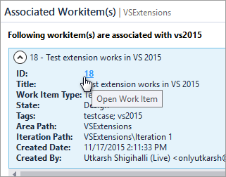

# Roadmap

- [x] Enable compatibility for Visual Studio 2015
- [ ] Support multiple editions of Visual Studio with single vsix package.
- [x] Open full workitem form from associated workitems instead of showing fixed fields.
- [ ] Check user permissions and enable/disable options shown in the `Actions` menu.

Features that have a checkmark are complete and available for
download in the
[CI build](http://vsixgallery.com/extension/a1e38ebe-f115-4ad6-bb1a-bf1c62ff4758/).

# Change log

These are the changes to each version that has been released
on the official Visual Studio extension gallery.

# 1.0.3

- [x] Allow opening workitems in full workitem form.

    

## 1.0

- [x] Initial release
- [x] View Active tags
- [x] Rename tag
- [x] Delete tags
- [x] View work items linked to tags
- [x] Supports both VSTS and TFS
- [x] Uses Integrated Authentication
