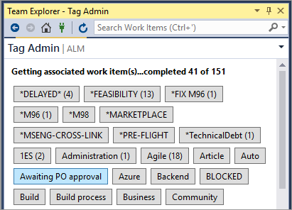
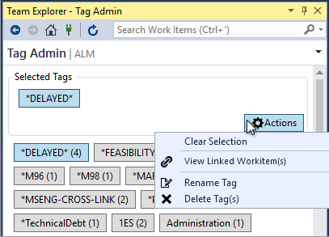
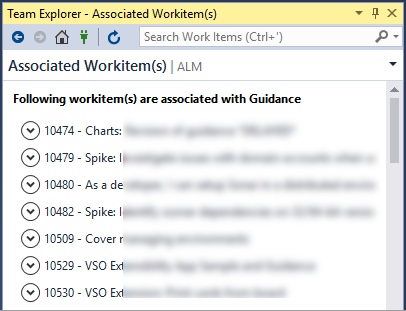

# Tag Admin for Visual Studio 2015

<!-- Replace this badge with your own-->

<!-- Update the VS Gallery link after you upload the VSIX-->
Download this extension from the [VS Gallery](https://visualstudiogallery.msdn.microsoft.com/[GuidFromGallery])
or get the [CI build](http://vsixgallery.com/extension/a1e38ebe-f115-4ad6-bb1a-bf1c62ff4758/).

---------------------------------------

Work Item Tags allow you to associate identifiers to work items to group search and filter work items easily. Tags can be added directly from the work item form or using the excel plug in. Adding tags is so easy that they start to grow in no time. While that’s a good thing you may not want people to create multiple tags that refer to the same thing. For example, BackOffice and Administration may have been created by users to refer to the same idea. However, these are now 2 separate entities, you will not be able to bring back work items tagged to BackOffice if searching exclusively for work items tagged to Administration. It’s also very easy to end up with tags that are misspelled.

### Screenshots

You can select one or more tags to additional options.

You can also view associated workitems for the selected tag.

See the [change log](CHANGELOG.md) for changes and road map.

## Features

With this extension you can easily manage Work Item tags from right with in Visual Studio. The extension also has below features.
- View Active tags
- Rename tag
- Delete tags
- View work items linked to tags
- Supports both VSTS and TFS
- Uses Integrated Authentication

## Permissions to administer Tags

Please see that you need to be part of "Readers" group to list the Tags. For full list of permissions required for tag administration please see [Tagging permissions](https://msdn.microsoft.com/en-us/library/ms252587.aspx#Tag).

## Contribute
Check out the [contribution guidelines](CONTRIBUTING.md)
if you want to contribute to this project.

For cloning and building this project yourself, make sure
to install the
[Extensibility Tools 2017](https://marketplace.visualstudio.com/items?itemName=MadsKristensen.ExtensibilityTools)
extension for Visual Studio which enables some features
used by this project.

## License
[Apache 2.0](LICENSE)